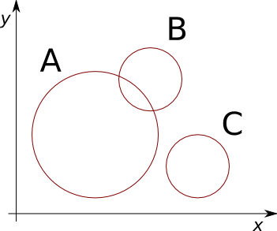
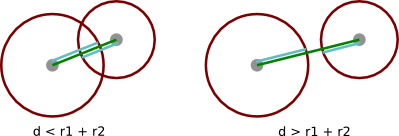

Ejercicios de la clase del 11 de junio
======================================

Compras de productos
--------------------
Un supermercado tiene registrados sus productos como un diccionario,
en el que el código del producto es la llave,
y el valor asociado es una tupla ``(nombre, precio)``::

    productos = {
        1248: ('jabón', 500),
        2194: ('palta', 650),
        8432: ('paraguas', 1000),
        # ...
    }

Además,
hay un diccionario llamado ``stock``
que indica cuántas unidades de cada producto quedan por vender::

    stock = {
        1248: 25,
        2194: 14,
        8432: 32,
        # ...
    }

Una compra puede ser representada
como una lista de tuplas ``(codigo, cantidad)``::

    compra = [(1248, 4), (4110, 9), (8432, 1)]

**Ejercicio 1:**
escriba una función ``precio_total(compra)``
que indique el total que hay que pagar por la compra.

Una manera de escribir la función es la siguiente::

    def precio_total(compra):
        total = 0
        for codigo, cantidad in compra:
            nombre, precio = producto[codigo]
            total = total + precio
        return total

**Ejercicio 2:**
escriba una función ``queda_stock(compra)``
que indique si hay suficiente stock para satisfacer la compra.

La manera ingenua de programar ``queda_stock`` es la siguiente::

    def queda_stock(compra):
        for codigo, cantidad in compra:
            if cantidad > stock[codigo]:
                return False
        return True

El problema es que esta función entrega la respuesta incorrecta
cuando un producto aparece varias veces en la compra::

    >>> queda_stock([(1248, 20), (2194, 10) (1248, 25)])
    True
    # En verdad, quedan 25 unidades del producto 1248
    # y se está intentando comprar 45.

Una manera de solucionar este problema
es sumando las cantidades de productos que están repetidos.
Para ello,
podemos crear un diccionario
asociando una cantidad a cada código::

    def queda_stock(compra):
        cuenta = {}
        for codigo, cantidad in compra:
            if codigo not in cuenta:
                cuenta[codigo] = 0
            cuenta[codigo] = cuenta[codigo] + cantidad

        for codigo in cuenta:
            if cuenta[codigo] > stock[codigo]:
                return False
        return True

Círculos
--------
**Ejercicio 1:**
escriba una función ``se_traslapan(c1, c2)``
que indique si dos círculos ``c1`` y ``c2`` se traslapan.

::

    >>> se_traslapan(A, B)
    True
    >>> se_traslapan(A, C)
    False

La primera pregunta que debemos hacernos es:
¿cómo representar un círculo en nuestro programa?

Para identificar un círculo en el plano,
nos basta con conocer tres datos:
las coordenadas :math:`x` e :math:`y` de su centro,
y su radio :math:`r`.
Entonces,
en el programa podemos representar los círculos
como tuplas de 3 valores ``(x, y, r)``::

    A = (21, 20, 17)
    B = (36, 34, 8)
    C = (48, 12, 8)

El siguiente paso es determinar cuándo dos circulos están traslapados.
Para eso, basta con comparar la distancia entre los centros
con la suma de sus radios:

         la suma de los radios es menor que
         la distancia entre los centros.

Por supuesto,
podemos reutilizar la función ``distancia``
que programamos `la semana pasada`_.
La solución el ejercicio queda así::

    def se_traslapan(c1, c2):
        x1, y1, r1 = c1
        x2, y2, r2 = c2
        d = distancia((x1, y1), (x2, y2))
        if d < r1 + r2:
            return True
        else:
            return False

.. _la semana pasada: ejercicios-4-junio.html#puntos-y-tri-ngulos

Una manera más breve de escribir la misma función es la siguiente::

    def se_traslapan(c1, c2):
        x1, y1, r1 = c1
        x2, y2, r2 = c2
        return distancia((x1, y1), (x2, y2)) < r1 + r2

Cuántas empiezan con la letra
-----------------------------
Escriba una función ``cuantas_empiezan_con(letra, oracion)``
que indique cuántas palabras de la oración
comienzan con la letra dada::

    >>> cuantas_empiezan_con('e', 'El elefante está en su casa en Europa')
    6
    >>> cuantas_empiezan_con('m', 'La mesa de María es azul')
    2
    >>> cuantas_empiezan_con('f', 'El xilófono está desafinado')
    0

El primer paso es descomponer la oración en palabras.
Para eso usamos el método ``oracion.split()``::

    >>> oracion = 'El elefante está en su casa en Europa'
    >>> oracion.split()
    ['El', 'elefante', 'está', 'en', 'su', 'casa', 'en', 'Europa']

Para evitar que la ``'E'`` mayúscula y la ``'e'`` minúscula
sean consideradas símbolos distintos,
conviene pasar primero toda la oración a minúsculas::

    >>> oracion.lower().split()
    ['el', 'elefante', 'está', 'en', 'su', 'casa', 'en', 'europa']

A continuación, debemos contar cuántas de las letras
comienzan con la letra dada.
Recordemos que siempre que hay que contar cosas,
se hace de la misma manera:
se inicializa un contador con el valor ``0``,
y se aumenta su valor en uno
cada vez que aparece lo que estamos contando.

La función queda así::

    def cuantas_empiezan_con(letra, oracion):
        palabras = oracion.lower().split()
        contador = 0
        for palabra in palabras:
            if palabra.startswith(letra.lower()):
                contador = contador + 1
        return contador

El método ``palabra.startswith(letra)`` permite determinar
si ``palabra`` comienza con ``letra``.
Otra manera de escribir la condición es la siguiente::

    if palabra[0] == letra.lower():
        contador = contador + 1

.. include:: disqus.rst

