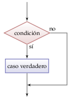
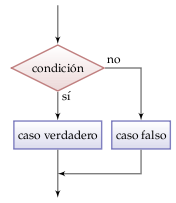
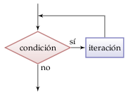

Sentencias de control
=====================
.. index:: sentencia

Un programa es una sucesión de **sentencias**
que son ejecutadas secuencialmente.

Por ejemplo, el siguiente programa tiene cuatro sentencias::

    n = int(input('Ingrese n: '))
    m = int(input('Ingrese m: '))
    suma = n + m
    print('La suma de n y m es:', suma)

Las primeras tres son asignaciones,
y la última es una llamada a función.
Al ejecutar el programa,
cada una de estas sentencias es ejecutada,
una después de la otra, una sola vez.

.. index:: sentencia de control

Además de las sentencias simples,
que son ejecutadas en secuencia,
existen las **sentencias de control**
que permiten modificar el flujo del programa
introduciendo ciclos y condicionales.

.. index:: condicional

Un **condicional** es un conjunto de sentencias
que pueden o no ejecutarse,
dependiendo del resultado de una condición.

.. index:: ciclo

Un **ciclo** es un conjunto de sentencias
que son ejecutadas varias veces,
hasta que una condición de término es satisfecha.

.. index:: indentación

Tanto los condicionales como los ciclos
contienen a otras sentencias.
Para indicar esta relación
se utiliza la **indentación**:
las sentencias contenidas
no se escriben en la misma columna
que la sentencia de control,
sino un poco más a la derecha::

    n = int(input())
    m = int(input())
    if m < n:
        t = m
        m = n
        n = t
    print(m, n)

En este ejemplo, las tres asignaciones
están contenidas dentro de la sentencia de control ``if``,
cuyo significado veremos más abajo.
El ``print(m, n)`` no está indentado,
por lo que no es parte de la sentencia ``if``.

Este programa tiene cuatro sentencias,
una de las cuales es una sentencia de control,
que contiene otras tres sentencias.

Para indentar,
utilizaremos siempre cuatro espacios.

Condicional if
--------------
.. index:: if

La sentencia **if**
(en español: «si»)
ejecuta instrucciones
sólo si se cumple una condición.
Si la condición es falsa,
no se hace nada.

La sintaxis es la siguiente::

    if condición:
        sentencias

Por ejemplo,
el siguente programa felicita a alguien
que aprobó la asignatura::

    nota = int(input('Ingrese su nota: '))
    if nota >= 55:
        print('Felicitaciones')

Condicional if-else
-------------------
.. index:: if-else

La sentencia **if-else**
(«si-o-si-no»)
decide qué instrucciones ejecutar
dependiendo si una condición es verdadera o falsa.
La sintaxis es la siguiente::

    if condición:
        sentencias en el caso verdadero
    else
        sentencias en el caso falso

Por ejemplo,
el siguiente programa indica a alguien si es mayor de edad::

    edad = int(input('¿Cuál es su edad?'))
    if edad < 18:
        print('Usted es menor de edad')
    else:
        print('Usted es adulto')

El siguiente programa realiza acciones distintas
dependiendo de si el número de entrada
es par o impar::

    n = int(input('Ingrese un número: '))
    if n % 2 == 0:
        print('El número es par')
        print('La mitad del número es', n // 2)
    else:
        print('El número es impar')
        print('El sucesor del número es', n + 1)
    print('Listo')

La última sentencia no está indentada,
por lo que no es parte del condicional,
y será ejecutada siempre.

Condicional if-elif-else
------------------------
.. index:: if-elif-else

La sentencia **if-elif-else**
depende de dos o más condiciones,
que son evaluadas en orden.
La primera que es verdadera
determina qué instrucciones serán ejecutadas.

La sintaxis es la siguiente::

    if condición1:
        sentencias en el caso 1
    elif condición2:
        sentencias en el caso 2
    ...
    else:
        sentencias cuando ninguna condición se cumple

Por ejemplo,
la tasa de impuesto a pagar por una persona según su sueldo
puede estar dada por la siguiente tabla:

====================== ====================
**sueldo**             **tasa de impuesto**
---------------------- --------------------
menos de 1000                            %0
1000 ≤ sueldo < 2000                     %5
2000 ≤ sueldo < 4000                    %10
4000 o más                              %12
====================== ====================

Entonces, el programa que calcula el impuesto a pagar
es el siguiente::

    sueldo = int(input('Ingrese su sueldo: '))
    if sueldo < 1000:
        tasa = 0.00
    elif sueldo < 2000:
        tasa = 0.05
    elif sueldo < 4000:
        tasa = 0.10
    else:
        tasa = 0.12
    print('Usted debe pagar', tasa * sueldo, 'de impuesto')

Ciclo while
-----------
.. index:: while

El ciclo **while**
(«mientras»)
ejecuta una secuencia de instrucciones
mientras una condición sea verdadera.

La condición es evaluada antes de cada iteración.
Si la condición es inicialmente falsa,
el ciclo no se ejecutará ninguna vez.

La sintaxis es la siguiente::

    while condición:
        sentencias

Por ejemplo,
el siguiente programa
multiplica dos números enteros
sin usar el operador ``*``::

    m = int(input())
    n = int(input())
    p = 0
    while m > 0:
        p = p + n
        m = m - 1
    print('El producto de m y n es', p)

Para ver cómo funciona este programa,
hagamos un ruteo con la entrada ``m`` = 4
y ``n`` = 7:

  +-------+-------+-------+
  | ``p`` | ``m`` | ``n`` |
  +=======+=======+=======+
  |       |   4   |     7 |
  +-------+-------+-------+
  |     0 |       |       |
  +-------+-------+-------+
  |     7 |   3   |       |
  +-------+-------+-------+
  |    14 |   2   |       |
  +-------+-------+-------+
  |    21 |   1   |       |
  +-------+-------+-------+
  |    28 |   0   |       |
  +-------+-------+-------+

En cada iteración,
el valor de ``m`` decrece en 1.
Cuando llega a 0,
la condición del ``while`` deja de ser verdadera
por lo que el ciclo termina.
De este modo,
se consigue que el resultado sea
sumar ``m`` veces el valor de ``n``.

Ciclo for
---------
.. index:: for, variable de control, iterable

El ciclo **for**
ejecuta una secuencia de sentencias
una vez por cada valor posible
que puede tomar una **variable de control**.
Los valores van siendo tomados
de un tipo especial de objeto
llamado **iterable**.

La sintaxis es la siguiente::

    for variable in iterable:
        sentencias

La manera de entender un ciclo ``for`` es la siguiente:
``iterable`` es un objeto que entrega varios valores en orden.
La ``variable`` toma cada uno de esos valores,
y las sentencias del ``for`` son ejecutadas
una vez por cada uno de esos valores.

Existen muchos tipos de iterables,
pero por ahora sólo vamos a ocupar los más comunes:
los rangos, los strings y las listas.

.. index:: rango, range

Un **rango** es una sucesión de números enteros equiespaciados.
Hay tres maneras de definir un rango::

    range(final)
    range(inicial, final)
    range(inicial, final, incremento)

El valor inicial siempre es parte del rango.
El valor final nunca es parte del rango.
El incremento indica la diferencia entre dos valores consecutivos del rango.

Si el valor inicial es omitido, se supone que es 0.
Si el incremento es omitido, se supone que es 1.

Con algunos ejemplos quedará más claro:

==================== ===================================
``range(9)``         0, 1, 2, 3, 4, 5, 6, 7, 8
``range(3, 13)``     3, 4, 5, 6, 7, 8, 9, 10, 11, 12, 13
``range(3, 13, 2)``  3, 5, 7, 9, 11
``range(11, 4)``     ningún valor
``range(11, 4, -1)`` 11, 10, 9, 8, 7, 6, 5
==================== ===================================

Por ejemplo,
el siguiente programa
calcula la suma de los primeros 20 números naturales::

    suma = 0
    for i in range(21):
        suma = suma + i
    print('La suma de los 20 primeros numeros naturales es', suma)

La sentencia dentro del ciclo ``for`` es ejecutada 21 veces.
La primera vez, ``i`` tiene el valor 0;
la segunda, el valor 1;
y así sucesivamente hasta llegar a 20.

El mismo programa puede ser escrito usando un ``while``,
pero es un poco más engorroso::

    suma = 0
    i = 0
    while i < 21:
        suma = suma + 1
        i = i + 1
    print('La suma de los 20 primeros numeros naturales es', suma)

Una regla general para saber qué ciclo conviene usar es:
el ``for`` se ocupa cuando se sabe de antemano cuántas iteraciones serán ejecutadas,
y el ``while`` cuando esto no es conocido.

El siguiente programa imprime una cuenta regresiva::

    for i in range(10, 0, -1):
        print(i)
    print('¡Feliz año nuevo!')

El iterable de un ``for`` también puede ser un string.
En este caso,
los valores que toma la variable de control
son cada uno de los símbolos que son parte del string.

Por ejemplo,
el siguiente programa le dice al usuario
cuántas veces aparece la letra *e* en su nombre::

    nombre = input('Escriba su nombre: ')
    n = 0
    for letra in nombre:
        if letra == 'e' or letra == 'E':
            n = n + 1
    print('La letra e aparece', n, 'veces en su nombre')

También es posible usar una lista como iterable.
Las listas (que veremos en detalle más adelante)
son representadas entre corchetes,
con sus valores separados por comas.

Por ejemplo,
el siguiente programa
muestra el largo de los nombres de varios animales::

    for animal in ['perro', 'gato', 'vaca', 'hamster']:
        largo_nombre = len(animal)
        print(animal, 'tiene largo', largo_nombre)

La salida del programa es::

    perro tiene largo 5
    gato tiene largo 4
    vaca tiene largo 4
    hamster tiene largo 7

Continuar y romper ciclos
-------------------------
.. index:: break, continue

.. include:: disqus.rst
