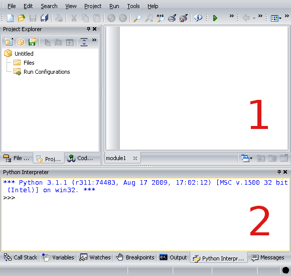

Cómo usar Python y PyScripter
=============================
.. index:: Python, lenguaje de programación

Python es el `lenguaje de programación`_ que utilizaremos
para escribir nuestros programas.

.. index:: intérprete

Un programa Python es un archivo de texto
que contiene las sentencias del programa.
Los programas que uno escribe
son ejecutados por otro programa
llamado **intérprete**.
Al igual que el lenguaje,
el intérprete se llama Python.

.. index:: entorno de desarrollo integrado, PyScripter

Para desarrollar programas,
es más conveniente usar un
`entorno de desarrollo integrado`_ (o IDE),
que hace más fácil la tarea de escribir código,
hacer pruebas y encontrar errores.
El entorno que usaremos se llama **PyScripter**.

.. _lenguaje de programación: http://es.wikipedia.org/wiki/Lenguaje_de_programación
.. _entorno de desarrollo integrado: http://es.wikipedia.org/wiki/Entorno_de_desarrollo_integrado

Uso del intérprete interactivo
------------------------------
.. index:: intérprete interactivo

El **intérprete interactivo**
permite ejecutar secciones de código
sin tener que escribir un programa completo.

En el intérprete interactivo
uno ingresa las sentencias una por una,
y son ejectuadas a medida que uno las va ingresando.
Esto es muy útil antes de escribir un programa
y para reparar errores en un programa ya escrito,
pues permite probar cada una de las instrucciones
por separado e ir viendo los resultados intermedios.

.. index:: prompt

Para indicar que uno puede escribir una instrucción,
el intérprete interactivo muestra lo que se denomina un **prompt**,
y que en Python se representa como ``>>>``.
El prompt *no* es parte de la instrucción,
y uno no debe escribirlo,
pues aparece solo.

Un ejemplo de sesión en el intérprete interactivo
es la siguiente::

    >>> x = 5
    >>> y = x + 2
    >>> print(x * y)
    35

En este ejemplo, las tres primeras líneas tienen el prompt,
por lo que representan instrucciones que escribió el usuario.
La cuarta línea no tiene prompt,
pues es la salida de la instrucción ``print()``.

Si uno ingresa una expresión
en el intérprete interactivo,
ella es evaluada
y el valor obtenido es mostrado en la línea siguiente::

    >>> x = 3
    >>> x ** 2
    9
    >>> x > 10
    False

Por lo tanto,
el intérprete interactivo puede ser utilizado
como si fuera una calculadora.

De aquí en adelante,
la mayoría de los ejemplos serán presentados
como sesiones del intérprete interactivo.
Las líneas que comienzan con el prompt ``>>>``
indican comandos que uno debe escribir,
y el resto de las líneas
muestran el resultado de esos comandos.

Cada vez que aparezca un ejemplo de este tipo,
usted debe abrir un intérprete
y probar las instrucciones de ejemplo
para comprobar que el resultado obtenido
es el correcto.
Además,
debe hacer más pruebas por su cuenta
para entender mejor el concepto enseñado.

Uso de PyScripter
-----------------

El entorno PyScripter tiene dos áreas importantes,
que en la imagen de arriba están señaladas
con números 1 y 2:

1. el **editor**,
   donde uno escribe los programas;
2. el **intérprete interactivo**,
   donde uno puede evaluar expresiones
   y probar secciones de código.

.. include:: disqus.rst

